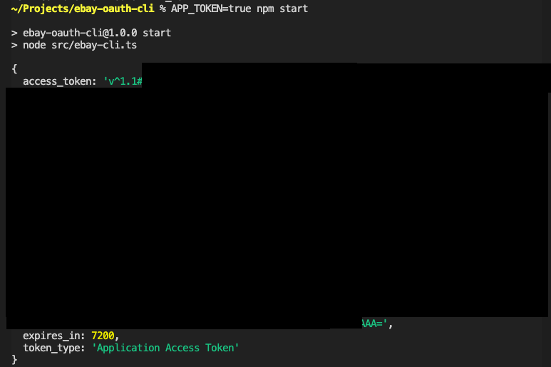
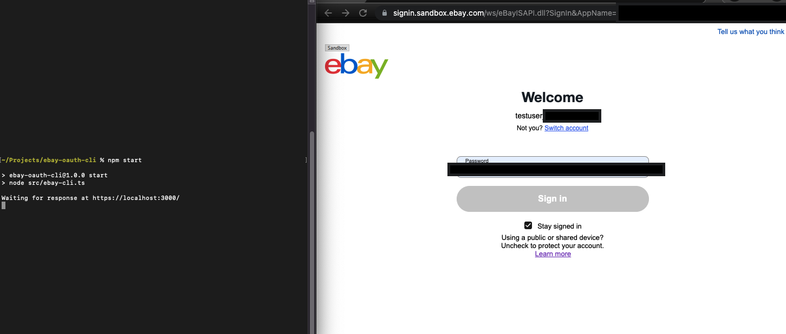
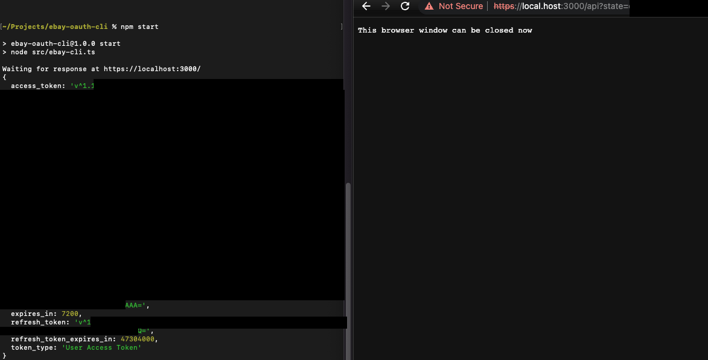
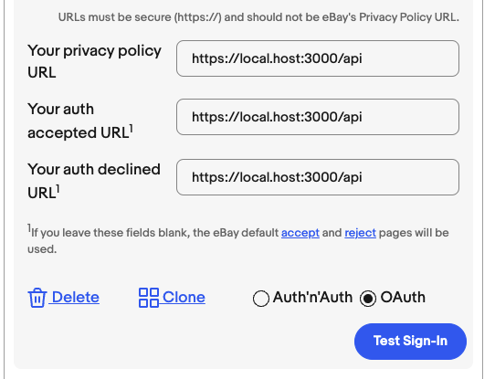

# Simple eBay Oauth CLI

## Introduction
As eBay uses a redirectUri object instead of a callback Url, I did not find a way to quickly and easily generate **User access tokens** to access eBay RESTful APIs (i.e. through Postman). 

By... 

1. Creating a fake valid callback url that points to localhost using `/etc/hosts`, as 'localhost' is not valid.
2. Setting the redirectUri's redirect URL to the fake valid url (in [eBay Developer](https://developer.ebay.com/my/keys)) 
3. Setting up a local NodeJS HTTPS server to listen on the redirect URL to parse the authorization code and exchange for a User token. 

...this cli tool can quickly generate **User access tokens** for local testing.

***Note: This is only intended for local development and testing purposes only, as it uses 'hacky methods' that are most probably unsafe to use in a production environment. Use at own risk.***

## Demo 

### Application Access Token 



### User Access Token





## Set up
1. Configure the redirectURI from [eBay Developer](https://developer.ebay.com/my/auth/) as below:

    

2. As shown above, we will be using 'local.host' as a fake valid url, as eBay does not accept 'localhost' as a valid callback url. Simply add the below line to `/etc/hosts` (Mac/Linux) or `C:\Windows\System32\drivers\etc\hosts` (Windows)
    ```
    127.0.0.1 local.host
    ```

3. Create certs for the local HTTPS server as below and place them in this project's root directory.
    ```
    openssl genrsa -out key.pem
    openssl req -new -key key.pem -out csr.pem
    openssl x509 -req -days 9999 -in csr.pem -signkey key.pem -out cert.pem
    rm csr.pem
    ```

4. Allow invalid certificates for resources loaded from *localhost* in Chrome (dont forgot to re-disable). Copy and pase the below into Chrome search bar. 
    ```
    chrome://flags/#allow-insecure-localhost
    ```
5. If after step 3 you still get a Chrome error message do the below ([from StackOverflow](https://stackoverflow.com/a/41020281))

    > *"When you see "Your connection is not private...NET::ERR_CERT_INVALID" warning on Chrome, Just type "thisisunsafe" (anywhere...key listeners pick it up) and wait."*


## Usage 

1. Rename `ebay-config-sample.json` to `ebay-config.json` and update with your credentials. Do not check this file into source control.

2. Edit the scopes variable in `ebay-cli.ts` as required by your appllication.

3. Run the cli tool to output a token to console:

For sandbox user token
```
npm start
```

For Production user token
```
PRODUCTION=true npm start
```

For sandbox app token 
```
APP_TOKEN=true npm start
```

For Production app token 
```
APP_TOKEN=true PRODUCTION=true npm start
```

# Dev 
Use 
```
local-ssl-proxy --source 3000 --target 3001 
```
to route https://localhost:3000 to http://localhost:3000

## Final Notes
As always, open to any suggestions, feedback, improvements! Feel free to drop a line.